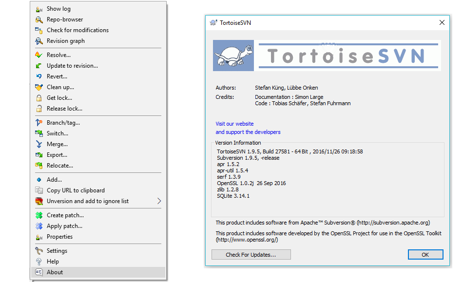
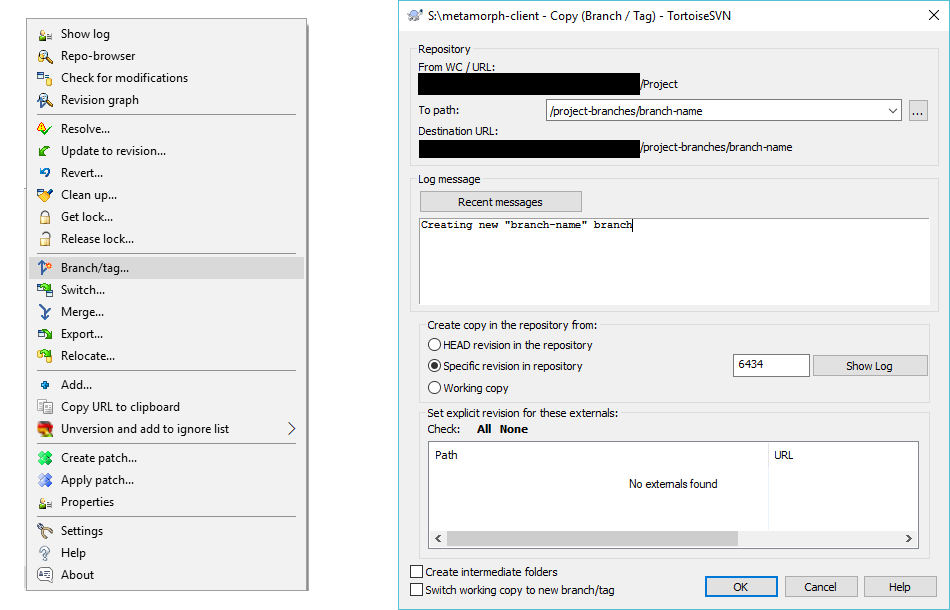
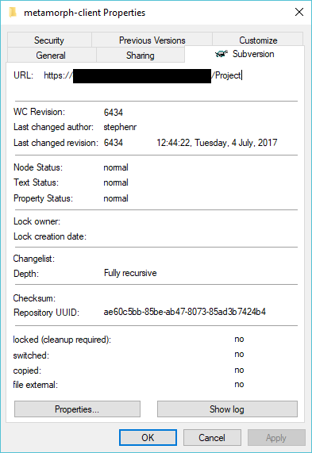
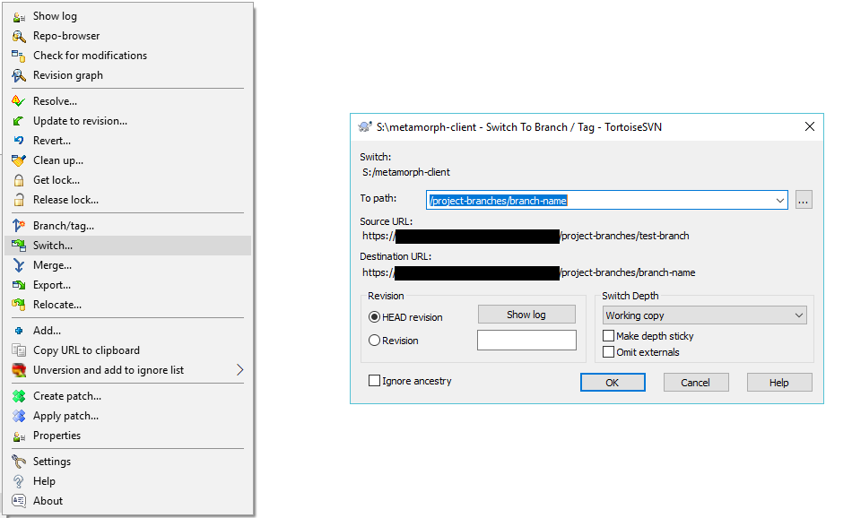
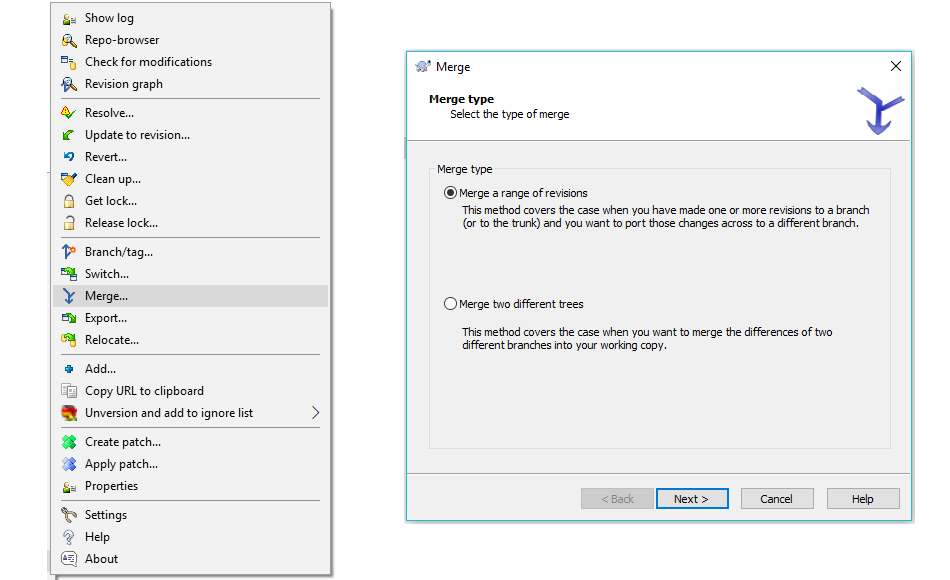
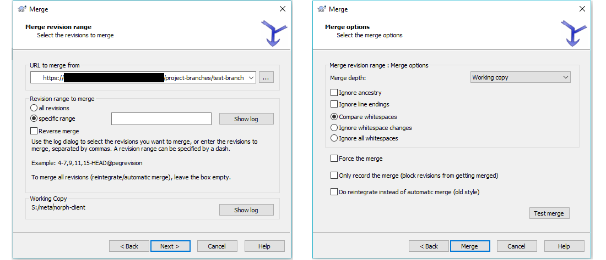
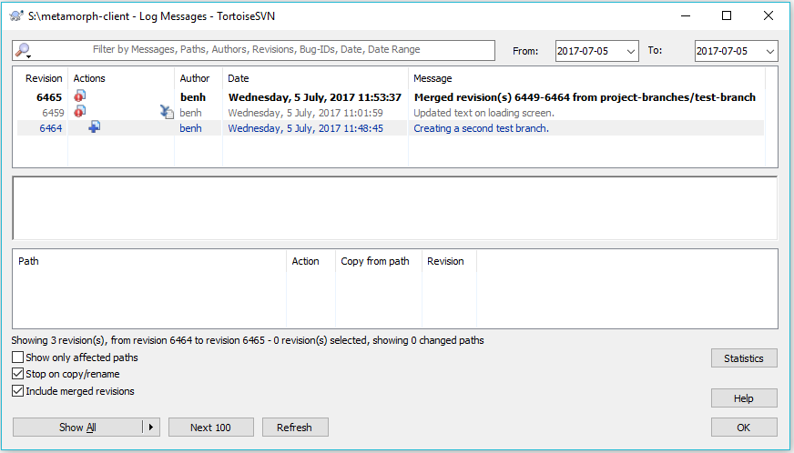
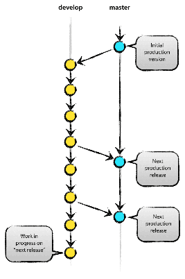
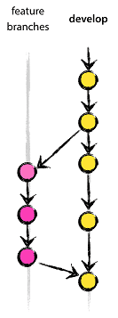
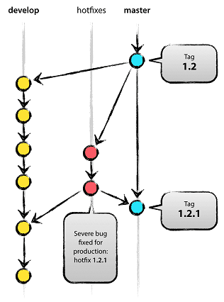

## Introduction

Metamorph is a Unity project that has been under active development for more than two years, in the hands of a wide cast of developers. During that time, changes to the code and assets have been stored and shared in a SVN repository. This approach has been broadly successful for in-house development and producing builds to demo at game industry shows, but with a Steam Early Access release planned for September 2017, we will shortly be required to maintain at least two different versions of the game: a stable (or, least, broadly playable) one that is available via Steam to paying customers, and a potentially unstable, buggy one with new, untested features that is only visible within Firefly. This increased complexity of production requirements will in turn require more involved strategies to manage changes to the project.

This document describes a strategy for managing project changes using SVN branches to split sets of changes into separate groups that can be merged selectively to produce builds of varying expected stability levels.

### The Problem

Once Metamorph has been released into Early Access and there is a live version in the hands of players (who will be keen to receive regular updates, but understandably upset if we break the game they've paid for), development will have to satisfy multiple competing aims. Specifically, we will want:
 - to show to early-access users that we are making active progress on the game by releasing frequently and regularly (possibly even weekly).
 - QA to be able to test a candidate version of the game before it is released, to avoid shipping a version of the game that breaks features that players were already enjoying.
 - to be able to continue work on new features without disrupting QA's testing of the candidate build.
 - to be able to work on complex features that may require development times longer than the time between releases.
 - to be able to issue hotfixes for critical bugs in the currently-released build, and have those fixes survive into future releases.
 - to be able to patch bugs discovered in the candidate version and have those fixes survive into future releases.

## Branches and tags

Branching is a feature available in most version-control systems that allows for multiple versions of the code and assets to exist side-by-side in the repository. This means that changes made to one branch do not affect others, so untested or work-in-progress commits can be made in one area of the project while preserving a known-good branch elsewhere in the repository. For a broad introduction to the concept, I'd recommend [Jeff Atwood's blog post][Atwood]<sup>1</sup> describing branches in version control by using the idea of "parallel universes" as an analogy.

Tags are a similar concept to branches, but they are intended to be immutable. That is, once you have created a parallel version of your code by tagging it, you will never commit any further changes to the tagged version, meaning it continues to exist in its original state (with bugs and all) forever. The main use for tags is to be able to refer back to specific named versions of the code at a future date. For example, you might tag the revision of your code that was released as v1.3 as "1.3" so that, even after releasing 1.4 or 1.5, you can still easily jump back to the state of the code in 1.3 to track down bugs reported in the older version (or to find out why something that was working then isn't any more...).

### Using branches in SVN

SVN treats branches as "copies" of the original code that exist within a different subdirectory of the repository. The typical directory structure for an SVN project is therefore:

 - `/trunk` - Contains the "trunk", or "master" branch of the project.
 - `/branches` - Contains several subdirectories, each holding a branch of the project.
 - `/tags` - Contains several subdirectories, each holding a tagged version of the project.

Metamorph, however, was not started with branching in mind, so the repository root instead contains several directories containing things like build server output, art assets and design docs. The Unity project itself lives within the `/Project` directory. Fortunately, because SVN just treats branches as directories, we can just store them anywhere we like in the repo. I've already created a `/project-branches` directory in the root which can be used to hold branches of the `/Project` directory. I suggest we also add a `/project-tags` directory to hold tagged versions in future.

The following sections aim to provide a quick introduction to creating, switching and merging branches in SVN. If you would like a more complete guide to branches and merging, I recommend [Chapter 4 ("Branching and Merging") of the SVN book][svnbook]<sup>2</sup>. The commands used for merging altered significantly in version 1.8 (they now automatically detect certain types of merge), so the following instructions (and the linked version of the SVN book) assume that you are using a version of SVN more recent than v1.8. You can check the version you are using with `svn --version` on the command line:

```
$ svn --version
svn, version 1.9.5 (r1770682)
   compiled Nov 26 2016, 14:22:31 on x86-microsoft-windows
```
Or by using the about command in Tortoise SVN:



#### Creating branches

Creating a branch in svn is easy. You can use the `svn copy` command on the command line, specifying the remote location you want to branch from, the location you'd like to create the new branch, and a commit message describing what you're doing:

```
$ svn copy ^/Project ^/project-branches/branch-name -m "Created 'branch-name' branch."
Committing transaction...
Committed revision 6448.
```

Alternatively, you can use the "Branch/tag" option in the Tortoise SVN GUI:



#### Switching branches

Usually after creating a branch, your local working copy will still be set to commit changes to whatever branch it was on before (although there is a "Switch working copy to new branch/tag" option in the Tortoise SVN GUI when creating a branch, visible above). If you're unsure about which branch your working copy is currently on, you can check via the command line using `svn info`:

```
$ svn info --show-item=url
https://svn.server.url/repo-location/Project
```

...or through the Tortoise SVN extension to the Windows directory properties pane:



To change your working copy so that changes you commit will be saved to a different branch, use the `svn switch` command:

```
$ svn switch ^/project-branches/branch-name
Updated to revision 6457
```

Or, use Tortoise SVN's switch dialogue:



Note that switching the branch of your working copy like this has two effects:

1. It changes the branch to which any changes you make will be committed.
2. It alters the files in your working copy so that they match the state of the most recent revision on the target branch.

The mechanism for the second effect is the same as that used during a normal `svn update`, so it will try to preserve uncommitted changes in your working copy, if you have any, and may therefore merge files (and generate merge conflicts) just as a normal update would. While it's probably not a great idea to make a habit of switching branches with uncommitted changes in your working copy, this does mean that you can make the decision that some potentially unstable work would be better off on a new branch _after_ making the changes locally.

Once your working copy is switched over to the correct branch, you can continue to work and commit changes as normal. Note that when updating, you will not receive changes that have been committed to other branches, and people working on other branches will not receive your changes. When you're ready to combine your changes with another branch, that's where merging comes in.

#### Merging branches

Imagine you've been working on a branch - call it A - and want to merge your changes back into the main development branch - we'll call that B. The procedure looks like this:

1. Make sure that you don't have any uncommitted changes left in your working copy.
1. Switch your working copy to branch B, getting any updates that others have committed to it since you branched off.
1. Merge branch A into your (now B-based) working copy.
1. Check that the merge has worked, compile, build, run tests, resolve conflicts and generally make sure nothing's broken.
1. Commit your local changes.
1. (Optionally) Delete branch A.

To actually perform the merge (Step 3), you can use the `svn merge` command:

```
$ svn merge ^/project-branches/branch-name
--- Merging differences between repository URLs into '.':
U    Main.scene
U    Code/Globals.cs
--- Recording mergeinfo for merge between repository URLs into '.':
 U   .
```

In Tortoise SVN, you can use the merge dialogue instead:



While there are a couple of steps to the merge dialogue, in most cases the default options are fine:



After resolving any merge conflicts and testing the project, you must then commit as normal to save your changes to the target branch (branch B in the example).

Once you commit, your changes will be available to other people using the target branch, and individual commits you made while on the source branch (A in the example) will be visible in the changelog for the target branch, using the "Include merged revisions" checkbox in Tortoise SVN:



After merging changes from a branch, in most situations it's a good idea to delete the branch, using either the `svn delete` command or the Tortoise SVN repository browser.

```
$ svn delete ^/project-branches/branch-name \
             -m "Removed branch-name, after reintegrating with trunk ."
```

This deletes the directory holding the branch, which helps to keep the repository clean and clear for other users. The commit history from the deleted branch is still available as part of the repo history as for any other deleted file, in case you ever need it.

### Using branches with Unity

Unity's integration with SVN is not especially elegant, so the specifics of how SVN branch operations affect Unity projects probably bears some discussion here. The main point to remember is that, as far as we're concerned, branch merge operations use the same mechanism to detect and resolve conflicts as a normal SVN update. That means that everything you were doing before to avoid merge issues with Unity scenes and prefabs in normal SVN use applies to branch merges as well. For instance, where possible, use prefabs to break scene components down into smaller, separately-editable chunks that people can make changes to without affecting the entire scene.

Even if you do end up making changes to a file that someone else has edited and get a conflict when you try to merge, that doesn't mean you have to scrap your changes. By setting the project to use text-based asset serialization (in Edit -> Project settings -> Editor), all scene and prefab files are stored as YAML, a text-based format that SVN's normal diff and merge tools ought to be able to handle most small changes to automatically. As a result, even if you get a merge conflict, it's worth examining conflicted scene and prefab files in an editor (Tortoise SVN has a good one available by right-clicking the conflict in the merge log and selecting "Edit conflicts") and attempting to manually resolve differences between the files. Often it comes down to some unimportant property of the scene or prefab (like a file ID) where the value from either changeset would be fine.

Large-scale changes to scenes and prefabs can result in unresolvable merge issues, though, so in general, it's probably a good idea to avoid making changes to a scene or prefab while someone else is working on it. This applies even when working in branches, and in fact is made worse, because you'll need to wait for whatever branch the changes are on to be merged with whatever branch you're working from before you can safely edit the scene/prefab (alternatively, you can just switch to the branch with the changes and make your edits there). There aren't really any perfect systems for managing this kind of collaborative clash (although [this article][Croci]<sup>3</sup> describes a great scene locking system based on physical items that I find very pleasing). For a small, distributed team like us, the best solutions are going to be communicating via Skype when we're about to make significant changes to a scene or prefab, and making sure to organise the project into as small components as is sensible, to reduce the probability of two people needing to make changes to the same file in the first place.

## The Strategy

The branching strategy described here and the images used to illustrate it are stolen more-or-less wholesale from [Vincent Driessen's excellent 2010 blog post][Driessen]<sup>4</sup> about a branching strategy he was using for git. I have abbreviated it somewhat here, and removed or modified the sections that are specific to git.

### Main branches

The core of the strategy is two branches with an infinite lifetime:

 - The master branch, stored at `/Project` (i.e. the trunk directory), which is the version that is used for production builds, so should always be in a _production-ready_ state.
 - The development branch, stored at `/project-branches/development`, which is the branch in which development work is combined before being turned into a release. It should always reflect a state with the latest delivered development changes for the next release.



When the source code in the develop branch reaches a stable point and is ready to be released, all of the changes should be merged back into the master branch somehow and then tagged with a release number (e.g. `/project-tags/1.4`). To allow QA some time to test the build before it goes live, however, we will introduce a third, "release" branch between the two.

### Release branches

A release branch is a temporary branch created as a staging area for the final preparations before deploying a build. It should be created from the development branch at the point at which all features for the next release are present, and named for the target release version (e.g. `/project-branches/release-1.4`).

Builds can then be created from this branch and used for testing, while work on new features continues on the development branch. Changes made to the release branch should be minimal, and limited to:
 - Minor bugfixes
 - Setting environment-specific metadata (e.g. changing Steam payments from sandbox mode to live, disabling debug menus)
 - Setting the version number

Design changes at this point are strictly prohibited - those should instead be committed to the development branch to go out in the _next_ version. A release branch should have a short lifespan: only as long as is needed to sign off on the build as stable and ready for release.

Once the code on a release branch is ready for deployment, it should be merged into the master branch, and the resulting revision on the master should be tagged for future reference. After that, the release branch should be immediately merged into the development branch, to preserve any bugfixes that were made to the branch. If this merge overwrites environment-specific metadata in the development branch with production values, it is important to remember to revert those changes at this point. After that, the release branch has served its purpose and should be deleted.

### Feature branches

Feature branches are used to develop new features for a future release. When starting development of a feature, the target release in which the feature will be incorporated may be unknown, and development may take longer than the time until the next release. By developing the feature on a separate branch (rather than committing to develop), we prevent half-finished and unstable features from blocking a scheduled release.



The essence of a feature branch is that it exists as long as the feature is in development, but will eventually be merged back into the development branch (to definitely add the new feature to the upcoming release) or discarded (in case of a disappointing experiment).

A new feature branch should be created from the current state of the development branch and should merge back into the development branch when complete. After being re-integrated, the feature branch should be deleted.

### Hotfix branches

In an ideal world, signing a release as stable would mean that the build was completely bug-free. In the real world, bugs - even critical ones - sometimes slip through the cracks. Hotfix branches are a way to address problems in released builds in a timely fashion.



When a critical bug in a production version must be resolved immediately, a hotfix branch may be branched off from the corresponding tag on the master branch that marks the production version. the hotfix branch should be named for the new version number that it will eventually create (e.g. `/project-branches/hotfix-1.4.1`). The essence is that work of team members on the develop branch can continue, while another person is preparing a quick production fix.

When finished, the bugfix needs to be merged back into master and tagged with a new version number. It also needs to be merged back into develop, in order to safeguard that the bugfix is included in the next release as well. After that, the hotfix branch can be deleted. This is identical to how release branches are finished.

### Summary

This branching strategy uses a total of five branch types: two core branches that exist perpetually in parallel, and three types of supporting branches that are used to manage and move changes between them.

Branch type | Branches off from | Merges back into       | Naming convention
----------- | ----------------- | ---------------------- | -----------------
Master      | -                 | -                      | `/Project`
Development | Master (once)     | Release branches       | `/project-branches/development`
Release     | Development       | Master and Development | `/project-branches/release-*`
Feature     | Development       | Development            | `/project-branches/*`
Hotfix      | Master            | Master and Development | `/project-branches/hotfix-*`

The following diagram depicts all of the various types of branch and their relationships in all their glory, along with some example usage:


While this arrangement of branches may appear complicated when presented all together in this format, in practice few members of the team are likely to need to concern themselves with the current state of every branch at any one time. That, in fact, is its advantage: developers working on new features need not worry about breaking the test build for the next release, and hotfixes can be deployed rapidly without waiting for new development to be put on hold. I am confident that with a concerted effort to adopt this method of working, it will rapidly become second-nature.

## References

1. [Software branching and parallel universes][Atwood], Jeff Atwood, _Coding Horror_, Oct 2007
1. [Chapter 4. Branching and Merging][svnbook], Ben Collins-Sussman, Brian W. Fitzpatrick & C. Michael Pilato, _Version Control with Subversion (for Subversion 1.8)_, 2016
1. [Project organization is no monster][Croci], Bruno Croci, _Made With Unity_, January 2017
1. [A successful git branching model][Driessen], Vincent Driessen, _nvie.com_, January 2010
1. [Version control: Effective use, issues and thoughts, from a gamedev perspective][Davis], Ash Davis, _Gamasutra_, Nov 2016
    - While I haven't specifically cited this article in the above document, and the branch/fork strategy described therein is unsuitable for use on a project with a production build in the wild, I feel that it nonetheless offers a useful primer on good version control habits in game development.


[Atwood]: https://blog.codinghorror.com/software-branching-and-parallel-universes/
[Driessen]: http://nvie.com/posts/a-successful-git-branching-model/
[Croci]: https://madewith.unity.com/en/stories/project-organization-is-no-monster
[Davis]: http://www.gamasutra.com/blogs/AshDavis/20161011/283058/Version_control_Effective_use_issues_and_thoughts_from_a_gamedev_perspective.php#usingversioncontroleffectively
[svnbook]: http://svnbook.red-bean.com/en/1.8/svn.branchmerge.html
